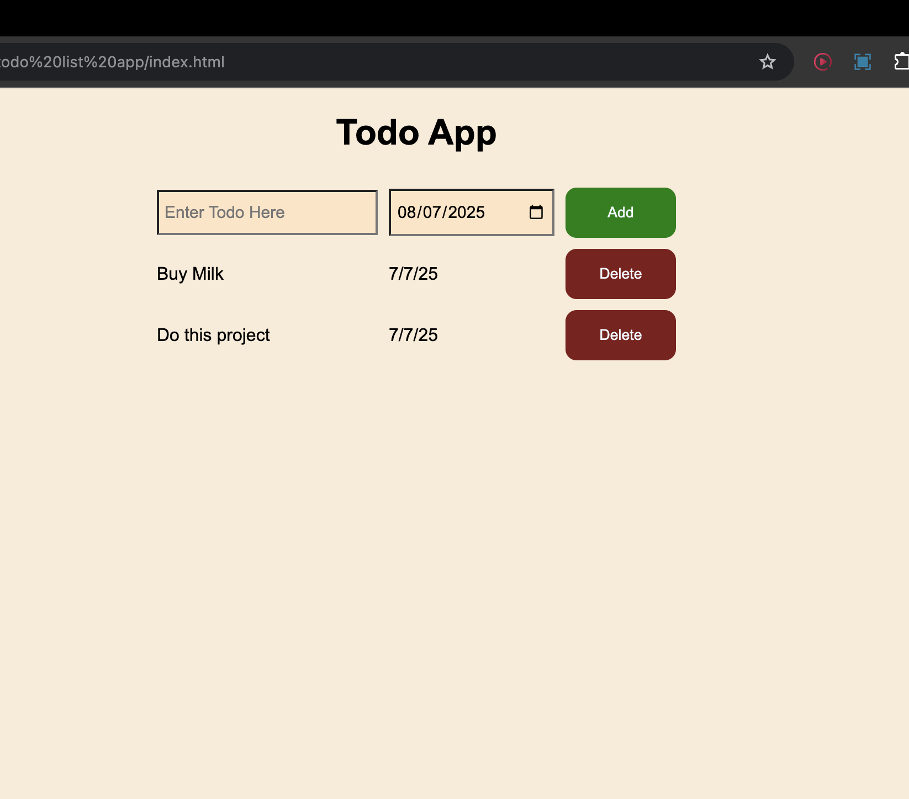

# To-Do List App

This is a **basic To-Do List application** built using **HTML**, **CSS**, and **JavaScript**. It allows users to add and display tasks in a simple and interactive interface.

## Features
- Add new to-do items
- Display a list of tasks
- Date selection for each task
- Clean and responsive user interface

## Technologies Used
- HTML
- CSS
- JavaScript

## Folder Structure
```
todo list app/
├── index.html
├── style.css
├── todo.js
├── README.md
└── image.png
```

## How to Run
1. Clone or download the repository.
2. Open `index.html` in your browser.
3. Start adding tasks to your list!

## Screenshot


## Author
Rohan Raj

---

We expand this project by adding local storage support or task completion features!
